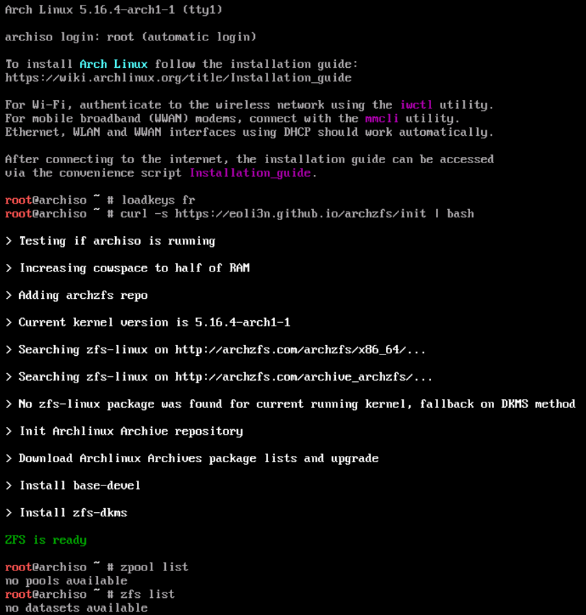

> [!IMPORTANT]
> 18 Nov. 2024 [Archzfs is not up to date for now](https://github.com/orgs/archzfs/discussions/555). zfs-dkms is 2.2.4, and it only builds on LTS. Archiso is shipped with main kernel 6.11. You need to use a custom archiso built on LTS with ZFS included.
> See https://github.com/r-maerz/archlinux-lts-zfs

### Why this

If you want to install Archlinux on ZFS, you need to deal with the [ZFS licensing problem](https://wiki.archlinux.org/index.php/ZFS). The kernel module isn't included in the default archiso image, you need to [include it](https://wiki.archlinux.org/index.php/ZFS#Embed_the_archzfs_packages_into_an_archiso) into a custom archiso image to be able to install ZFS.

I wrote an article about [archiso netbooting](https://eoli3n.github.io/2020/04/25/recovery.html).  
This script lets you include the zfs kernel module on any archiso image without creating a custom one.

### Archzfs

The [Archzfs](https://github.com/archzfs/archzfs/wiki) unofficial user repository offers multiple ways to install the ZFS kernel module.  
We can install precompiled module with ``zfs-linux`` package or compile the zfs module using [DKMS method](https://wiki.archlinux.org/index.php/ZFS#DKMS).  
In order to build the module, DKMS needs the ``linux-headers`` package for the running kernel.

### How does it work

It extracts running kernel version and try to find a matching ZFS module in ``Archzfs`` repositories.
If it doesn't, it fallbacks to the DKMS build of the ZFS module.
In that case, the script uses [Arch Linux Archive](https://wiki.archlinux.org/index.php/Arch_Linux_Archive#How_to_restore_all_packages_to_a_specific_date) to install the ``linux-headers`` and ``base-devel`` packages required for DKMS. You need at least ~6Gb RAM to use that method to be able to store packages in cowspace.

In some very specific cases, you won't be able to get ZFS module working for a specific archiso version.  
In that case, just switch to the previous month iso.

### How to use

Boot on any archiso system, and run:
```
$ curl -s https://raw.githubusercontent.com/eoli3n/archiso-zfs/master/init | bash
```



### Debug

By default, command outputs are redirected to /dev/null.
To run the script in verbose mode, use:
```
$ curl -s https://raw.githubusercontent.com/eoli3n/archiso-zfs/master/init | bash -s -- -v
```
Running the script produces a ``debug.log`` file in the current directory.
To upload this easily, you can

```
$ pacman -Syy pastebinit
$ pastebinit -b sprunge.us debug.log
```
And then paste me the url in your issue.

### Dev

To easily generate a VM with the latest archiso, to test the script in, on your host with qemu/libvirt and vagrant installed :
Use [https://github.com/eoli3n/arch-config/tree/master/vagrant](https://github.com/eoli3n/arch-config/tree/master/vagrant).

### Related

- [Archzfs issue : Dynamically build/load ZFS module on default archiso #337](https://github.com/archzfs/archzfs/issues/337)
- [Archlinux Wiki : Install Arch Linux On ZFS](https://wiki.archlinux.org/index.php/Install_Arch_Linux_on_ZFS#Get_ZFS_module_on_archiso_system)
